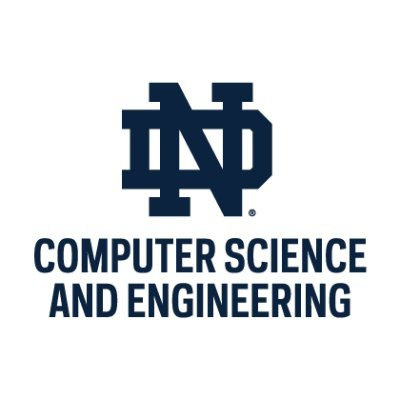

Welcome to my website!

![Image][IMG_1521.jpeg]
## About

I am a current sophomore at the University of Notre Dame studying Computer Science and Engineering and Engineering Corporate Practice. I am originally from New Egypt, New Jersey, a small town about 30 minutes outside of Princeton. This website displays some projects that I have completed and that I am currently working on, so I hope you enjoy!

## Projects

### Block.io
#### + [Block.io](project.c)

### Crossword
#### + [Crossword Header](crossfunc.h)
#### + [Crossword Functions](crossfunc.c)
#### + [Crossword Main](crossword.c)

#### Currently, I am enrolled in Data Structures, Systems Programming, and Logic Design. I have already taken Fundamentals of Computing and Discrete Mathematics.
#### You can reach out to me using email or LinkedIn!
#### cdevine5@nd.edu
#### + [LinkedIn](https://www.linkedin.com/in/charles-devine3/)

